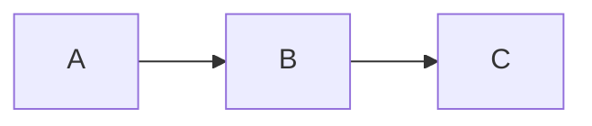

# Render Gallery

A single source of truth for the rendering regression net. Every feature
the desktop live editor must keep rendering polished is exercised by one
section below; the four-layer regression suite (Playwright pixel diff,
block-tree oracle, WDIO selector smoke, v0.4.0 baseline audit) consumes
this file unchanged.

The document title above is the sole `h1` in the fixture so the Layer 4
audit can split entries unambiguously by `##`-level headings. The
`## Headings` section heading below is itself the live `h2` sample;
the nested `h3` through `h6` demonstrations follow inside it. Together
with the document title this covers all six heading levels.

## Headings

### Heading sample three
#### Heading sample four
##### Heading sample five
###### Heading sample six

## Unordered list

- First bullet
- Second bullet, with **bold inside**
- Third bullet

## Ordered list

1. First step
2. Second step
3. Third step

## Blockquote

> A short quoted paragraph.
> A second line of the same quote.

## Fenced code

```python
def greet(name: str) -> str:
    return f"Hello, {name}!"
```

## Mermaid



## Table

| Column A | Column B | Column C |
|----------|----------|----------|
| 1        | 2        | 3        |
| 4        | 5        | 6        |

## Inline marks

A paragraph with **bold**, *italic*, ~~strikethrough~~, and `inline code`.

## Link

See the [example link](https://example.com/anchor) for more.

## Inline image

An inline  and trailing prose.

## Long line (word-wrap exercise)

This is a deliberately long line meant to force the live editor's word-wrap setting to kick in and to keep horizontal scroll out of the document surface: lorem ipsum dolor sit amet, consectetur adipiscing elit, sed do eiusmod tempor incididunt ut labore et dolore magna aliqua, ut enim ad minim veniam, quis nostrud exercitation ullamco laboris nisi ut aliquip ex ea commodo consequat.

## Selectable phrases

The first selectable phrase appears here. The second selectable phrase appears here.
